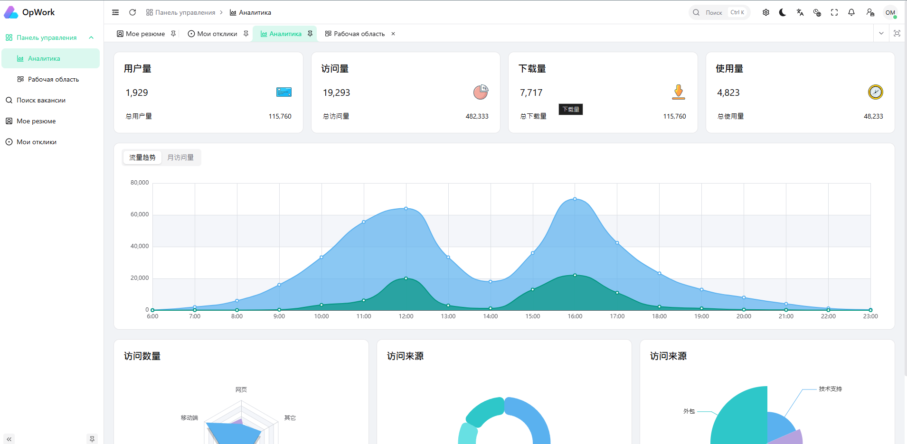
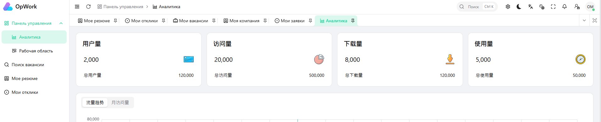

# РУКОВОДСТВО ПО OPWORK

## Первый раз заходим на сайт

Когда закодим и чел не авторизован то кидаем его на страницу авторизации и видим поля емайл и пасс

туду:

- поменять иконку
- копирайт сменить
- убрать темизацию
- убрать темную тему
- китайский язык убрать
- поеменять заголовок и описание страницы

## Регистрация пользователя

На странице регистрации нажимаем "Создать аккаунт" и попадаем на страницу реги

туду:

- политику или зменить на то что обычно пишут на таких сайтах или удалить это поле и анонимизировать компании и резюмешки все
- валидацию согласия нужно делать в бэке

### После регистрации попадаем на страницу аналитики по учетке соискателя

Сейчас страница моковая с некой аналитикой

туду:

- убрать панель управления
- если регались как компания то должны входить как компания а не как соискатель
- если компания еще не заполнялось - упдайтедат нулл, кидаем на страницу "Моя компания"
- если страница заполнялась то кидаем на страницу с зявками

## Входим на сайт

Сейчас страница моковая с некой аналитикой

туду:

- если регались как соискатель то должны входить как соискатель
- если резюме еще не заполнялось - упдайтедат нулл, кидаем на страницу "Моя резюме"
- если страница заполнялась то кидаем на страницу с откликами

## Настройки интерфейса

Сейчас мы можем разные настройки интерфейса ставить, нужно убрать возможность кастомизации

туду:

- нужно настроить в неком виде и отрубить боковую панел вообще
  
- убрать настройки часового пояса
- убрать кнопку на весь экран

## Смена активного профиля

При регистрации создаются два профиля: как соискатель и как компания, активным становится тот который был укзан при регистрации
Активный пофиль используется при входе в систему

## Работаем как компания

### Моя компания

На этой странице заполняем основную информацию о компании

### Мои вакансии

На этой странице мы создаем вакансии для нашей компании, если их много, то можно фильтровать при выдаче

Если в поле "Статус" не "Активна" то вакансия не отображается соискателям.

#### Добавление/редактирование вакансии

Для добавления новой вакансии справа есть кнопка добавить

После нажатия переходим на страницу добавления вакансии

туду:

- статус запретить редактировать
- для каждого статуса сделать отдельную кнопку
- статус по умолчанию - черновик
- дата публикации должна ставится сама при смене статуса на - активна
- пункт удаленная работа должен иметь третий враиант - любой
- валюта зп должен быть селект с списком валют
- поля уровень опыта, требования и обязанности сделать опциональными в базе и везде

Когда нажали создать нас перекидывает на страницу просмотра вакансии

туду:

- должно было перекинуть на страницу редактрования вакансии

На странице редактирования мы видим две таблицы с доп данными: "Тэги вакансии" и "Требуемые навыки"

##### Теги вакансии

Тэги нужны чтобы группировать различные вакансии для удобного взаимодействия с ними

Тэги можно добавлять/изменить

туду:

- добавить тип контрола для выбора цвета в генератор и во всех кастомах поправить разметку под нее
  можно удалять
  

##### Требуемые навыки

Список навыков которые нужны для выполнения работы по данной вакансии

Навыки можно добавлять/изменить, впроцессе можно выбрать существующий навык или создать свой

можно удалять

#### Просмотр вакансии

На эту страницу можно попасть из списка вакансий, а также после создания или изменения вакансии

#### Удаление вакансии

Кнопка удаления находится сверху справа, при удалении вакансии появляется большое окно с запросом на удаление

После удаления ничего не происходит
туду:

- после успешного удаления нас должно перекидывать на страницу список вакансий

#### Список вакансий

Из страницы вакансий мы можем перейти в редактировнаие вакансии, а также можем удалить вакансию

На странице есть панель для установления сортировки

туду:

- Там есть кнопка Добавить, нужно ее переименовать в Добавить вакансию

Если вызвать удаление на карточке с вакансией, то появится окно с запросом на удаление

Если нажать кнопку редактирования то нас перекинет на страницу редактирования вакансии

Слева есть панель с различными фильтрами, где можно выбрать тэг, навык, текст и другие параметры фильтрации своих вакансий, это нужно на случай если у вас очень много вакансий.

туду:

- Нужно переименовать Фильтр в Фильтры вакансий
- Кнопку нужно переименовать Найти вакансию

### Мои заявки

Когда соискатели откликаются на вакансию то их отклик можно посмотреть на странице "Мои заявки", там отображается список основной информации по откликам соискателей.

### Описание заявки

Если нажать на заявку то мы попадем в подробное описание заявки

### Статус

Для каждой вакансии компания может менять статус

Также можно писать дополнительные примечания

туду:

- Нужно хранить историю статусов и примечаний

Статус видно в карточке заявки

### Фильтры

Если заявок очень много, то их можно фильтровать с помощью дополнительных фильтров

туду:

- Нужно в фильтрах переимновать заголовок в Фильтры заявок
- Нужно кнопка переименовать в Найти заявку

## Работаем как соискатель

### Мое резюме

На этой странице личная и профессиональная информация о соискателе

Если в поле "Готов приступить к работе" стоит "Нет", то резюме скрыто от компаний.

#### Образование

На странице с резюме есть табличка с информацией об образовании

Для добавления места учебы нужно нажать кнопку Создать сверху над табличкой

туду:

- Наверное стоит убрать месяц и день и оставить только год в месте учебы

Созданные места учебы можно удалять, для этого нажимаем кнопку Удалить на месте учебы которое хотим удалить

#### Опыт работы

На странице с резюме есть табличка с информацией о месте работы

Для добавления места работы нужно нажать кнопку Создать сверху над табличкой

туду:

- Наверное стоит убрать месяц и день и оставить только год в месте работы

Созданные места работ можно удалять, для этого нажимаем кнопку Удалить на месте работы которое хотим удалить

#### Навыки соискателя

На странице с резюме есть табличка с информацией о навыках соискателя

Для добавления нового навыка нужно нажать кнопку Создать сверху над табличкой

туду:

- Возможно нужно удалить поле последний раз использовался, так вообще не понятно для чего оно

В навыках есть только базовые типовые навыки, если нужно добавить новый то необходимо вписать его название в специальное поле "Новый навык"

При сохранении навык автоматически создастся и закрепится за текущим пользователем

Добавленные навыки можно удалять, для этого нажимаем кнопку Удалить на навыке которое хотим удалить

### Поиск вакансии

Поиск вакансии происходит на странице "Поиск вакансий"

Для фильтрации есть панель с фильтрами где можем отметить параметры вакансии на которую хотим откликнуться

После фильтрации мы видим список вакансий, если видим потходящую вакансию то можно открыть подробную информацию о ней, нажав на саму вакансию в списке вакансий

### Отклик на вакансию

Для того чтобы откликнуться на вакансию необходимо нажать на кнопку откликнуться

После чего появится окно в которое нужно вписать сопроводительное письмо

В вакансиях на которые откликнулись конпка откликнуться будет заблокирована

### Мои отклики

Все отклики соискателя можно посмотреть на странице "Мои отклики"

Если откликов много то можно отфильтровать через панель фильтров

туду:

- Переименовать Фильтры в Фильтрация откликов
- Переименовать Найти в Найти отклики

Для просмотра подробной информации по отклику, нужно нажать на необходимый отклик в списке откликови мы перейдем в расширенный вид отклика

## Глобальный поиск

В шапке сайта есть поля ввода для поиска по сайту, этот функционал должен показывать информацию из страниц поска вакансий, резюме, заявок, параметров компании, параметров профиля и показывать панельку с вариантами контента в который можно перейти нажав на необходиый контент

## Нотификации

Нотификации отображаются в верхем правом углу, когда мы нажимаем на иконку с Уведомлениями у нас отображается список со всеми нотификациями для текущего профиля.

Если мы переключимся с профиля соискателя на профиль компании мы увидем дургой список уведомлений, так как произошла смена активного профиля.

Когда соискатель откликается на вакансию то в компанию приходит нотификация об этом

туду:

- Там иконки не отображаются, нужно их убрать илои починить
- Кнопка посмотреть все - ниче не деланет, нужно починить или удалить вообще

Когда компания переводит статус - эта информация падает соискателю в виде нотификации
туду:

- Вообще нет такого функционала

## Вопросы для уточнения контекста перед генерацией финального руководства

### 1. Цель и аудитория руководства

- Для кого делаем финальную версию: для конечных пользователей, для тестировщиков, для команды разработки, или для всех сразу? - для конечных пользователей, но тудушки нужно оставить я хочу по ним создать ишьюс гитхаб
- Какой формат нужен: "пользовательская инструкция" (как пользоваться) или "спецификация требований" (как должно работать)? - пользовательская инструкция
- Какой уровень детализации нужен: краткий onboarding, полный пошаговый мануал, или оба варианта? -  полный пошаговый мануал
- На каком языке выпускаем итог: только русский или нужен английский дубль? - сейчас только русский

### 2. Термины и единый словарь

- Фиксируем названия сущностей: "заявка", "отклик", "резюме", "вакансия", "профиль", "компания" (чтобы везде были одинаковые термины)? - да
- Что считается "активным профилем": отдельно для UI, API и бизнес-логики одинаково? - бизнес логика
- Нужен ли отдельный раздел с определениями терминов в начале руководства? - да

### 3. Авторизация и регистрация

- Какие обязательные поля регистрации для каждого типа пользователя (соискатель/компания)? - регистрация одна и таже для обоих просто выбираем активный профиль
- Можно ли сменить тип профиля после регистрации, и если да, как именно? - можно через шапку навигации
- Подтверждение email обязательно? Если да, когда и что блокируется до подтверждения? - обязательно, без подтверждения нельзя отклик оставить, публиковать вакансию, публиковать резюме
- Политика/согласие: оставляем как обязательный чекбокс или убираем поле полностью? - пока уберем, так как соблюдение всех норм отдельно нужно будет добавлять

### 4. Роутинг и стартовые страницы

- Подтверди точные правила редиректа после логина для каждого типа профиля. - для компаний если не заполнен профиль то кидаем на него, если профиль заполнен и нет вакансий кидаем на страницу создания вакансии, если есть профиль и вакансия то кидаем на страницу мои вакансии. для соискателей, сперва профиль если не заполнен, потом резюме если не заполнен, потом мои заявки
- Что является признаком "профиль заполнен": `updatedAt != null` или отдельный флаг завершенности? да значит часть полей заполнили, даже хоть пустыми значениями
- Куда редиректить пользователя после регистрации и после повторного входа в каждом сценарии? - для компаний если не заполнен профиль то кидаем на него, если профиль заполнен и нет вакансий кидаем на страницу создания вакансии, если есть профиль и вакансия то кидаем на страницу мои вакансии. для соискателей, сперва профиль если не заполнен, потом резюме если не заполнен, потом мои заявки
- Что делать, если оба профиля заполнены, но активный профиль не совпадает с последним использованным? - последний использованный всегда будет активным

### 5. Статусы и жизненные циклы

- Подтверди полный список статусов вакансии и переходов между ними (матрица переходов). - DRAFT,ACTIVE,PAUSED,CLOSED,ARCHIVED
- Подтверди полный список статусов отклика и кто может менять каждый статус. - PENDING,REVIEWED,SHORTLISTED,INTERVIEW,OFFER,REJECTED,WITHDRAWN. их может менять только система и компания
- Какие статусы финальные/необратимые? - нет таких
- Историю статусов/примечаний храним с версионированием, автором изменения и временем? да

### 6. Права доступа

- Что может делать соискатель, что может делать компания, что доступно обоим? - соискатель может заполнять профиль, создавать резюме, откликаться на вакансии, искать вакансии. компания может заполнять профиль, создавать вакансии, искать резюме
- Нужны ли ограничения на просмотр чужих данных (чужие вакансии, чужие отклики, чужие резюме)? - нет
- Есть ли роль администратора и отдельные сценарии для нее? - пока нет

### 7. Формы и валидация

- Какие поля обязательные/опциональные по каждой форме (вакансия, резюме, компания, отклик)? - в схеме базы все есть backend/prisma/schema.prisma
- Где валидируем каждое правило: только фронтенд, только бэкенд, или оба? - оба
- Какие лимиты: длина полей, количество навыков/тегов, размер сопроводительного письма? - есть в схеме базы данных backend/prisma/schema.prisma
- Нужна ли автосохраняемая черновая версия для длинных форм? - думаю да нужно будет добавить

### 8. Фильтры, поиск, сортировки

- Какие фильтры обязательны в каждом разделе, какие опциональны? - поиск по тексту и можно глянуть в методах бэка
- По каким полям должен работать глобальный поиск и в каком порядке показывать результаты? - в коде бэка можно посмотреть 
- Нужна ли поддержка частичного совпадения, опечаток, синонимов, морфологии? - хотел по навыкам такое сделать, но пока отложил, нужно таксу на это написать
- Нужна ли пагинация/лимиты и сохранение последних параметров фильтра? - да, но не сейчас отдельной таской нужно будет это офромить

### 9. Нотификации

- Какие события точно должны создавать нотификации (минимальный обязательный список)? отклик на вакансию, смена статуса и примечания
- Канал только внутри интерфейса или еще email/push/telegram? - сейчас только внутри сайта
- Нотификации изолируются по активному профилю или есть общий центр уведомлений? - по каждому профилю свой список нотификаций
- Что делает кнопка "Посмотреть все": отдельная страница, модалка или переход в список? - она должна была открыть список всех нотификаций, даже тех которые просмотрены и находятся в архиве

### 10. UI/UX и контент

- Подтверди финальные тексты кнопок и заголовков (для всех мест, где сейчас "переименовать"). - путсь будет также
- Какие настройки интерфейса оставляем, а какие полностью удаляем из UI и из бэкенда? - я описывал это сверху этой доки
- Нужна ли темная тема в будущем (скрыть сейчас) или удаляем поддержку целиком? будет потом, пока нет
- Нужен ли набор стандартных пустых состояний/ошибок/подсказок для всех страниц? - да

### 11. Данные, миграции, совместимость

- Для полей, которые становятся опциональными, нужна ли миграция существующих данных? - нет, пока продукт не в проде можно все сносить
- Есть ли уже данные продакшена, которые нельзя сломать при изменении схемы? - нет
- Какие поля критично нельзя переименовывать из-за внешних интеграций? - нет таких

### 12. Приоритеты и план реализации

- Какие 5-10 задач из `туду` считаем приоритетом первой очереди? - нет такого списка, я просто выписал по пути все что вспомнил
- Что блокирует релиз, а что можно оставить на post-MVP? - пока нет релиза, туду которые я описал нужно будет все сделать
- Нужен ли чеклист приемки по каждому разделу (Definition of Done)? - нет
- Какая дата целевого релиза и есть ли этапы (v1, v1.1, v2)? - нету

P.S. Еще я планирую добавить:
- Переписку возможность переписки между соискателем и компанией
- Нужно добавить возможность компаниям отправлять приглашения в виде заявок просто эти заявки помечать иначе и возможно в отдельном пункте меню показывать
- Планирую еще дашборд по всем данным показывать и соискателям и компаниям

## Дополнительные уточнения (зафиксировано)

- Роль `ADMIN` в пользовательском руководстве полностью скрываем, как будто ее не существует.
- Статус отклика `WITHDRAWN` может выставлять только соискатель.
- Скрытые сущности (резюме не готово к работе, вакансия не `ACTIVE`) должны быть недоступны везде для других пользователей.
- История статусов и примечаний открывается отдельной кнопкой рядом с текущим статусом/примечанием.

## Переписка между соискателем и компанией

После отклика соискателя и/или при приглашении от компании доступен чат между сторонами, где можно уточнить детали вакансии, ожидания, формат интервью и договоренности по следующим шагам.

`TODO: добавить скриншот после реализации`

## Приглашения от компании

Компания может отправлять приглашения соискателям в формате заявок. Такие заявки отображаются как отдельный тип, чтобы их можно было отличить от обычных откликов соискателя.

`TODO: добавить скриншот списка приглашений после реализации`

`TODO: добавить скриншот карточки приглашения после реализации`

## Дашборд

Для соискателя и компании доступен дашборд с ключевыми метриками и сводной информацией по активности: отклики, заявки, статусы, динамика за период и важные события.

`TODO: добавить скриншот дашборда соискателя после реализации`

`TODO: добавить скриншот дашборда компании после реализации`
